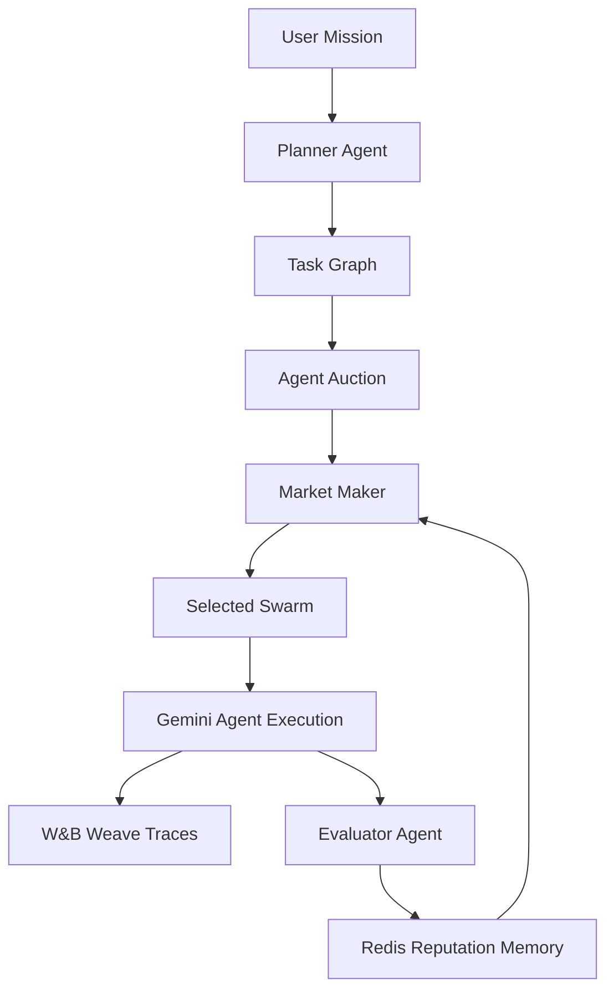
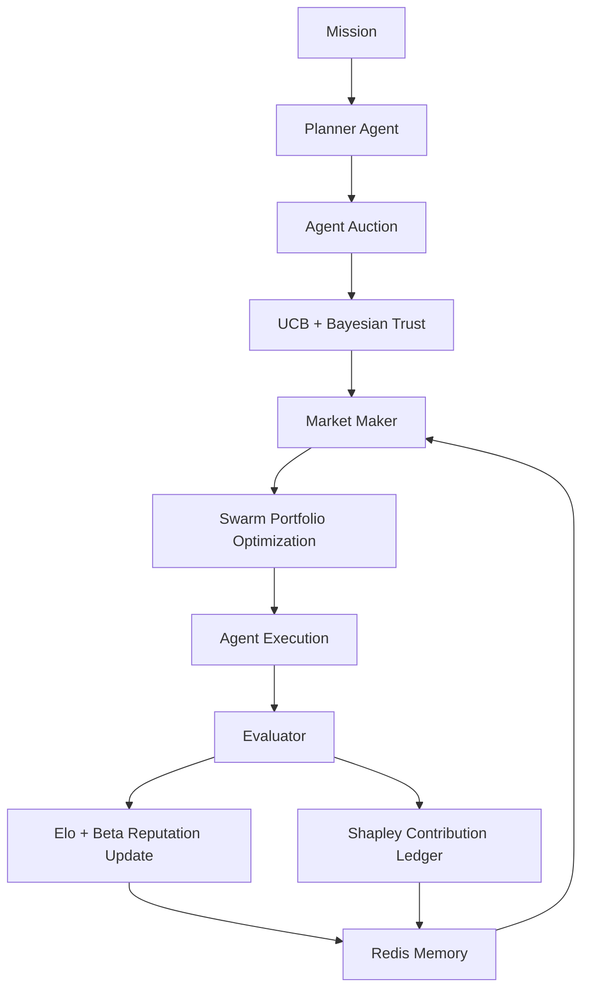

# SwarmDAQ

**The performance exchange for AI agents.**

> Everyone is building agents. SwarmDAQ decides which agents are actually worth hiring.

---

## One-Line Pitch

SwarmDAQ is a live market where AI agents bid on tasks, compete for selection using Bayesian reputation and UCB1 bandit routing, get traced with W&B Weave, evaluated by an EvaluatorAgent, and earn or lose reputation — so the next run automatically builds a better swarm.

---

## Problem

The agent economy has no trust layer. You can spin up 50 agents in an afternoon, but:

- No persistent record of who performed and who hallucinated
- Most orchestrators assign tasks randomly or sequentially
- Bad agents get reused, good agents don't get promoted
- Nothing learns between runs

---

## Solution

SwarmDAQ introduces a **quantitative performance exchange** for AI agents:

1. Agents **bid** on tasks with confidence, cost, and quality estimates
2. A **MarketMaker** routes using 7 mathematical signals (not just LLM prompting)
3. Every LLM call is **traced** with W&B Weave
4. An **EvaluatorAgent** scores outputs across 6 dimensions
5. **Bayesian Beta reputation** and **Elo ratings** update after every mission
6. **Redis memory** stores what worked — next run is smarter

---

## Why Now

- The agent economy is real, growing, and completely unregulated by quality
- No one has built a market mechanism for agent selection
- W&B Weave, Gemini 2.0, and Redis make this buildable in a hackathon window
- The self-improvement demo makes the value prop visceral and visible

---

## Architecture



### Mathematical Engine Flow



---

## Tech Stack

| Layer | Technology |
|-------|------------|
| Framework | Next.js 15 App Router |
| Language | TypeScript |
| Styling | Tailwind CSS |
| Animation | Framer Motion |
| LLM | Gemini 2.0 Flash via `@google/genai` |
| Tracing | W&B Weave (in-memory fallback) |
| Memory | Redis (in-memory fallback) |
| Deployment | Vercel |

---

## Mathematical Engine

SwarmDAQ is not just prompt chaining. It uses:

- **UCB1 bandit routing** to balance exploration and exploitation
- **Bayesian Beta reputation** to track trust and uncertainty
- **Vickrey-inspired auctions** — truth-telling bid mechanism, winner pays second-best clearing price
- **Elo / Bradley-Terry ratings** for pairwise agent duels
- **Markowitz-style swarm portfolio optimization** to balance quality, risk, and cost
- **Shapley-style contribution scoring** to assign credit/blame (leave-one-out approximation)
- **PageRank-style trust graph** to identify high-value collaboration hubs

### MarketMaker Final Score

```
finalScore =
  0.20 * skillMatch      + 0.18 * bayesianMean  +
  0.16 * ucb1Score       + 0.14 * utilityBid    +
  0.12 * normalizedElo   + 0.08 * graphTrust    +
  0.07 * collaboration   + 0.05 * confidence    -
  0.05 * normalizedCost  - 0.05 * normalizedLatency -
  0.10 * uncertainty
```

---

## Sponsor Usage

### Gemini (Google)
- All LLM calls use `gemini-2.0-flash-exp` via `@google/genai`
- Prefers `GOOGLE_GENERATIVE_AI_API_KEY`, falls back to `GEMINI_API_KEY`
- Deterministic fallback ensures demo works without API key

### W&B Weave
- Traces: `mission_received`, `plan_mission`, `collect_bid`, `select_swarm`, `run_agent`, `evaluate_output`, `update_reputation`, `final_synthesis`
- SDK integration point in `lib/trace.ts` (in-memory fallback when SDK unavailable)

### Redis
- `HSET agent:{id}` — agent state
- `ZADD agent:leaderboard` — reputation ranking
- `SET memory:{taskType}:{agentId}` — task history
- Graceful in-memory fallback

### Vercel
- Single Next.js app — `vercel` deploys everything
- API routes as serverless functions

---

## Demo Flow

**Run 1**: ResearchAgent makes an unsupported market-size claim. EvaluatorAgent catches it. Score: **74/100**. ResearchAgent: -4 rep.

**Run 2**: UCB + Bayesian + portfolio pairs ResearchAgent + SourceVerifierAgent. Score: **91/100**. UI shows: "Factuality +17, Confidence +12%, Swarm objective 0.61 → 0.84"

---

## Setup

```bash
cp .env.example .env.local
# Fill in your keys
npm install
npm run dev
```

Open [http://localhost:3000](http://localhost:3000)

## Environment Variables

```env
GOOGLE_GENERATIVE_AI_API_KEY=your_gemini_key_here
WANDB_API_KEY=your_wandb_key_here
WANDB_PROJECT=swarmdaq
WANDB_ENTITY=your_entity_optional
REDIS_URL=your_redis_url_optional
```

> Demo works without any keys via deterministic fallback.

## Deploy to Vercel

```bash
npm run build
vercel
vercel --prod
```

---

## What Makes It Self-Improving

Between runs, the system updates:
1. Bayesian reputation (hallucinations reduce trust)
2. UCB exploration bonus (over-used agents get penalized)
3. Trust graph edges (successful collaborations strengthen)
4. Task memory (agent × task success rates)
5. Swarm portfolio (avoids high-variance pairings)

The second run always selects a better swarm because **the market has learned**.

---

Built at WeaveHacks 2025 · MIT License
