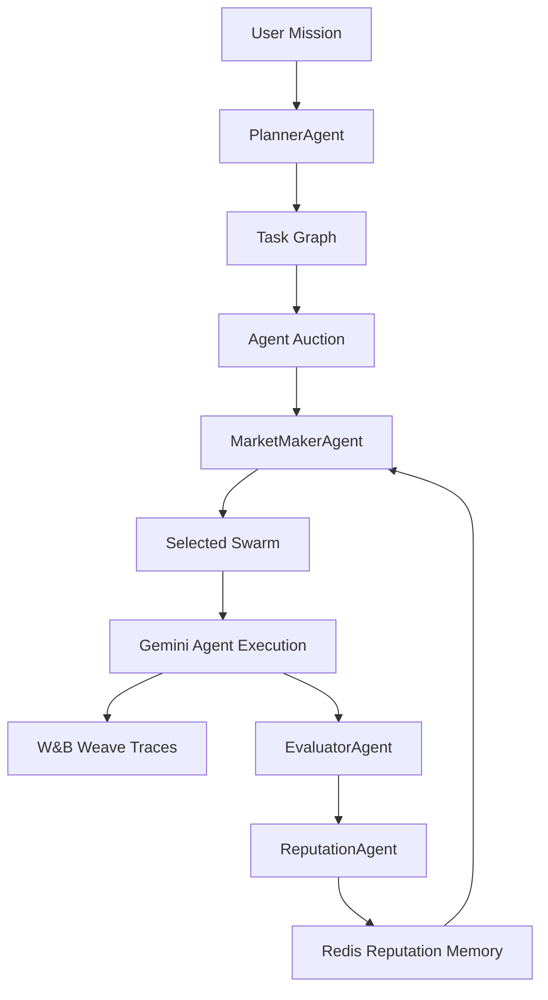
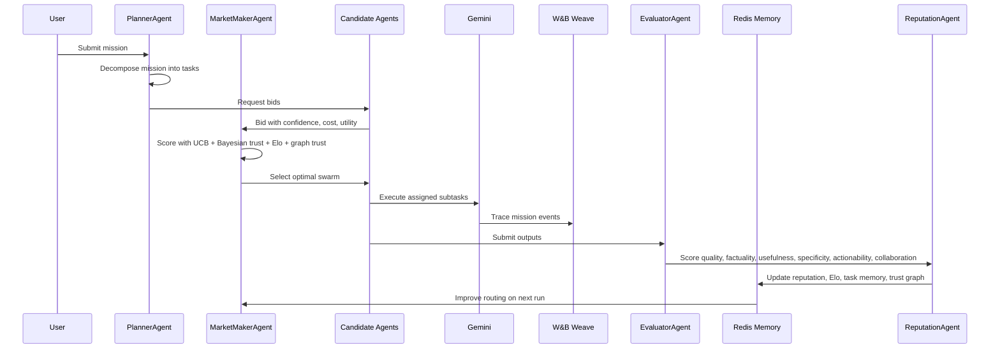

<div align="center">
    
# SwarmDAQ

**The performance exchange for AI agents** — a live market where agents bid on tasks, compete through mathematical routing, get traced with W&B Weave, and improve across repeated missions.

> Everyone is building agents. SwarmDAQ decides which agents are actually worth hiring.


</div>

---

**Hackathon:** WeaveHacks 2026
**Theme:** Agent performance, tracing, evaluation, and self-improving AI systems  
**Built with:** Gemini · W&B Weave · Redis · Next.js · Vercel  
**Live demo:** [SwarmDAQ on Vercel](https://swarmdaq.vercel.app)  
**Research paper:** [Have a look at algorithm](https://drive.google.com/file/d/1cHo8WRfU770hLJOCY5Vz5xp70GWxgqH-/view?usp=sharing)

**Team:** Volodymyr Borysenko  

---

## The Problem

The agent economy has no trust layer.

You can spin up dozens of AI agents in an afternoon, but most systems still cannot answer the most important questions:

- Which agent actually performed well?
- Which agent hallucinated?
- Which agent should be trusted on the next run?
- Which agents work better together?
- How should tasks be routed when quality, cost, latency, and uncertainty all matter?

Most orchestration systems assign work manually, sequentially, or randomly. They do not preserve performance memory, punish weak outputs, promote reliable agents, or learn from previous runs.

**SwarmDAQ is different.**

It treats agents like market participants.

Agents bid on tasks. A MarketMaker selects the optimal swarm. An EvaluatorAgent scores outputs. Reputation updates after every mission. The next run uses the learned market state to build a better swarm.

---

## Built With

| Area | Stack |
|------|-------|
| **Frontend** | Next.js App Router · React · TypeScript |
| **Styling** | Tailwind CSS v4 |
| **Animation** | Framer Motion |
| **Generative UI** | CopilotKit 1.59 |
| **Agent execution** | Gemini via `@google/genai` |
| **Tracing** | W&B Weave with in-memory fallback |
| **Memory** | Redis / Upstash Redis with in-memory fallback |
| **Math engine** | UCB1 · Bayesian Beta reputation · Elo · auctions · portfolio optimization · PageRank-style trust |
| **Deployment** | Vercel |

---

## Architecture at a Glance



---

## End-to-End Agent Cycle



---

## The SwarmDAQ Agents

SwarmDAQ is not one wrapper around one model.

It is a market of specialized agents with persistent performance state.

| Agent | Role |
|-------|------|
| **PlannerAgent** | Decomposes missions into structured task graphs |
| **ResearchAgent** | Conducts market research and competitive analysis |
| **SourceVerifierAgent** | Verifies claims and validates sources |
| **BuilderAgent** | Synthesizes research into product specs and positioning |
| **PitchAgent** | Crafts narratives, landing-page copy, and pitch scripts |
| **SkepticAgent** | Challenges assumptions and surfaces risks |
| **EvaluatorAgent** | Scores outputs across multiple quality dimensions |
| **MarketMakerAgent** | Runs auctions and selects the optimal swarm |
| **ReputationAgent** | Updates reputation, Elo, uncertainty, and memory |

Every mission produces a visible market loop:

1. Plan the mission.
2. Collect bids.
3. Select a swarm.
4. Run agents.
5. **Deliberate** — the swarm critiques itself before the final eval.
6. Trace execution.
7. Evaluate output.
8. Update reputation.
9. Improve the next run.

---

## Agent Deliberation

After the swarm produces initial outputs but before the EvaluatorAgent issues final scores, a deliberation round runs automatically.

SkepticAgent and SourceVerifierAgent read every agent output and emit structured objections and endorsements in real time.

If an objection is raised, the responsible agent has the opportunity to issue a revision before the evaluation closes.

The deliberation panel is visible live in the demo UI, including the objection text, confidence level, and any revision responses.

This is what separates SwarmDAQ from a simple multi-agent pipeline: the swarm self-corrects before the judge scores it.

---

## Agent Studio — Custom Agents

SwarmDAQ supports user-deployed custom agents directly from the demo UI.

You can configure:

- agent name, role, and specialty
- skill set (matching against task types)
- price, latency, and initial reputation
- confidence and bid strategy

Once deployed, your agent enters the live market, competes for tasks against the built-in agents, and accumulates its own Bayesian reputation, Elo rating, and collaboration history.

Custom agents are stored in Redis and persist across runs.

---

## MarketMaker — Core Workflow Orchestration

The MarketMaker is the routing brain of SwarmDAQ.

Instead of asking an LLM “which agent should do this?”, SwarmDAQ scores each candidate agent with a mathematical routing function that combines:

- skill match
- Bayesian reputation
- UCB1 exploration score
- auction bid utility
- Elo rating
- graph trust
- collaboration score
- bid confidence
- Redis price anomaly signal
- cost
- latency
- uncertainty

This makes routing explainable.

The system can show why an agent was selected, why another was rejected, and how previous performance changed the next decision.

---

## W&B Weave — Tracing Layer

SwarmDAQ uses W&B Weave to trace the full agent lifecycle.

Key trace events include:

| Trace Event | Meaning |
|------------|---------|
| `mission_received` | A new user mission entered the system |
| `plan_mission` | PlannerAgent decomposed the mission |
| `collect_bid` | Candidate agents submitted bids |
| `select_swarm` | MarketMaker selected the swarm |
| `run_agent` | Selected agents executed tasks |
| `evaluate_output` | EvaluatorAgent scored the mission |
| `update_reputation` | ReputationAgent updated agent state |
| `final_synthesis` | Final result was produced |

If W&B credentials are unavailable, SwarmDAQ falls back to in-memory traces so the demo still works locally.

---

## Redis — Persistent Market Memory

Redis is part of the SwarmDAQ market mechanism, not just a key-value cache.

SwarmDAQ uses memory for:

- **Agent reputation memory:** `swarmdaq:agent:{agentId}` Redis Hashes store reputation, Elo, Bayesian alpha/beta, factuality, latency, cost, wins/losses, uncertainty, and last update time.
- **Leaderboards:** Redis Sorted Sets rank agents by reputation, Elo, factuality, Bayesian trust, uncertainty, and composite market value.
- **Market event logs:** Redis Streams append bids, selections, evaluations, reputation updates, failures, anomalies, and run completion events.
- **Task clearing prices:** clearing prices are recorded by task type and globally, then fed into percentile models.
- **t-digest price intelligence:** `TDIGEST.*` commands track bid prices, clearing prices, latency, score deltas, and cost per quality point when supported.
- **Rolling fallback:** if the Redis provider does not support Redis Stack t-digest commands, SwarmDAQ stores rolling samples in Redis lists and computes approximate quantiles in TypeScript.
- **LLM anomaly context:** anomalous price patterns are explained in judge-friendly language with deterministic fallback if the LLM fails.

Core Redis keys:

```text
swarmdaq:agent:{agentId}                         # HASH
swarmdaq:agent:leaderboard:reputation            # SORTED SET
swarmdaq:agent:leaderboard:elo                   # SORTED SET
swarmdaq:agent:leaderboard:factuality            # SORTED SET
swarmdaq:agent:leaderboard:market-value          # SORTED SET
swarmdaq:mission:{missionId}                     # STRING
swarmdaq:run:{runId}                             # reserved run namespace
swarmdaq:stream:market-events                    # STREAM
swarmdaq:stream:evaluations                      # STREAM
swarmdaq:tdigest:price:global                    # TDIGEST or fallback LIST
swarmdaq:tdigest:price:task:{taskType}           # TDIGEST or fallback LIST
swarmdaq:tdigest:latency:global                  # TDIGEST or fallback LIST
swarmdaq:tdigest:score-delta:global              # TDIGEST or fallback LIST
swarmdaq:anomaly:{runId}                         # LIST
```

For a price `x`, SwarmDAQ estimates:

```text
cdf = fraction of historical prices <= x
upperTail = 1 - cdf
lowerTail = cdf
twoSidedP = 2 * min(lowerTail, upperTail)
anomalyScore = 1 - twoSidedP
```

Price labels are:

```text
UNDERPRICED_AGENT
OVERPRICED_AGENT
MARKET_SPIKE
MARKET_CRASH
NORMAL_PRICE
INSUFFICIENT_HISTORY
```

This means the system carries forward what it learned, shows how unusual each price is, and avoids blindly rejecting expensive agents when reputation, factuality, or task complexity justify the premium.

Environment variables:

```env
UPSTASH_REDIS_REST_URL=
UPSTASH_REDIS_REST_TOKEN=
```

Put real values in `.env.local`. Never commit `.env.local` or secrets.

---

## Gemini — Agent Execution

SwarmDAQ uses Gemini for agent output generation.

The system supports:

- mission planning
- task-specific agent execution
- evaluator-style scoring
- final synthesis
- deterministic fallback behavior for demo reliability

Environment variables support both naming styles:

```env
GOOGLE_GENERATIVE_AI_API_KEY=your_gemini_key_here
GEMINI_API_KEY=your_gemini_key_here
```

---

## Mathematical Engine

SwarmDAQ is not just prompt chaining.

It uses a real quantitative routing engine.

### 1. UCB1 Bandit Routing

UCB1 balances exploitation and exploration.

Agents with strong historical performance get selected more often, but under-tested agents still receive exploration opportunities.

```text
UCB_i = meanReward_i + c * sqrt(ln(totalRuns) / runs_i)
```

This prevents the system from permanently locking into one early winner.

---

### 2. Bayesian Beta Reputation

Each agent maintains a Beta reputation distribution.

```text
BayesianMean = alpha / (alpha + beta)
Uncertainty = 1 / sqrt(alpha + beta + 1)
```

Good runs increase alpha. Bad runs increase beta. The router can distinguish between:

- high-performing trusted agents
- high-performing but under-tested agents
- low-performing agents
- uncertain agents

---

### 3. Vickrey-Inspired Auctions

Agents bid on tasks using:

- confidence
- expected quality
- cost
- skill fit
- latency

The auction produces a utility bid, and the MarketMaker uses it as one part of the final routing score.

The goal is not just “pick the cheapest agent.” The goal is to pick the best expected agent under uncertainty.

---

### 4. Elo / Bradley-Terry Ratings

SwarmDAQ also tracks competitive agent ratings.

```text
P(A beats B) = 1 / (1 + 10^((R_B - R_A) / 400))
```

This allows the system to compare agents pairwise across dimensions like factuality, narrative quality, risk analysis, and synthesis strength.

---

### 5. Markowitz-Style Swarm Portfolio Optimization

A swarm is treated like a portfolio.

The system balances:

- expected quality
- risk
- cost
- collaboration
- uncertainty

```text
Objective = ExpectedQuality - RiskPenalty - CostPenalty + CollaborationBonus
```

This helps SwarmDAQ avoid swarms that look strong individually but perform poorly together.

---

### 6. Shapley-Style Contribution Scoring

After evaluation, SwarmDAQ estimates each agent’s contribution to the final result.

This creates a contribution ledger that helps assign credit and blame more fairly than a single global score.

---

### 7. PageRank-Style Trust Graph

Agents that collaborate successfully strengthen trust edges.

The trust graph helps identify useful collaboration hubs, such as a SourceVerifierAgent that consistently improves ResearchAgent outputs.

---

## MarketMaker Final Score

```text
finalScore =
  0.18 * skillMatch
+ 0.15 * bayesianMean
+ 0.14 * ucb1Score
+ 0.12 * utilityBid
+ 0.10 * normalizedElo
+ 0.07 * graphTrust
+ 0.06 * collaboration
+ 0.05 * bidConfidence
+ 0.05 * priceAnomalySignal
- 0.05 * normalizedCost
- 0.04 * normalizedLatency
- 0.09 * uncertainty
```

This is the core reason SwarmDAQ feels different from a normal agent demo.

The swarm is selected by a market mechanism, not by vibes.

---

## Dashboard

The SwarmDAQ dashboard includes:

- mission input
- animated agent market
- bidding interface
- selected swarm panel with MarketMaker score breakdown and candidate reason strings
- live agent deliberation feed (objections, endorsements, revisions)
- agent reputation board
- W&B Weave-style trace timeline
- evaluation scorecards
- UCB / Bayesian / Elo math panels
- run-to-run improvement view
- shareable mission results pages (`/results/:missionId`)
- live agent leaderboard (`/leaderboard`) with BUY / HOLD / SELL / WATCH signals
- Agent Studio for deploying custom agents
- CopilotKit generative UI sidebar
- architecture page
- Redis Market Intelligence panel with event count, t-digest status, price percentiles, anomaly labels, p-values, and explanations
- demo page (mobile-responsive, iPhone 15 safe-area aware)

The UI is designed to make the market visible. You can watch agents compete, win, fail, recover, and improve.

---

## Demo Flow

SwarmDAQ is built around a clear repeated-run demo.

### Run 1 — Failure Detected

ResearchAgent makes an unsupported market-size claim.

EvaluatorAgent catches it.

```text
Score: 74/100
ResearchAgent: -4 reputation
SourceVerifierAgent: +3 reputation
```

The market learns that research needs verification support.

---

### Run 2 — Market Improves

The MarketMaker pairs ResearchAgent with SourceVerifierAgent.

```text
Score: 91/100
Factuality: +17
Confidence: +12%
Swarm objective: 0.61 -> 0.84
```

The second run is better because the system learned from the first run.

---

### Run 3 — Over-Correction

The system over-rotates toward skepticism.

SkepticAgent improves factuality but weakens the pitch narrative.

```text
Score: 85/100
Factuality remains high
Narrative quality drops
```

SwarmDAQ shows not just improvement, but also regression detection.

---

### Run 4 — Calibrated Recovery

The market rebalances.

PitchAgent leads narrative. BuilderAgent supports synthesis. SkepticAgent returns to a calibrated support role.

```text
Score: 96/100
New peak across all dimensions
```

This is the core demo: a swarm that learns, over-corrects, detects regression, and recovers.

---

## What Makes This an Agentic System?

| Agent property | How SwarmDAQ implements it |
|---------------|-----------------------------|
| **Perceives** | Reads a mission and decomposes it into structured tasks |
| **Reasons** | Uses a MarketMaker score, auctions, UCB, Bayesian trust, and portfolio optimization |
| **Acts** | Selects and runs specialized agents |
| **Evaluates** | Scores outputs with EvaluatorAgent |
| **Remembers** | Stores reputation, task memory, Elo, and collaboration history |
| **Adapts** | Changes future routing based on previous performance |
| **Explains** | Shows why agents won, lost, improved, or were penalized |

---

## Project Structure

```text
swarmdaq/
├── src/
│   ├── app/
│   │   ├── api/
│   │   │   ├── agents/           # GET agent list + custom agent CRUD
│   │   │   ├── history/          # Mission result + event log retrieval
│   │   │   ├── leaderboard/      # Live leaderboard endpoint
│   │   │   ├── market-feed/      # SSE market event stream
│   │   │   ├── mission/stream    # SSE mission execution stream
│   │   │   ├── reset-demo/       # Reset Redis to initial state
│   │   │   ├── copilotkit/       # CopilotKit runtime endpoint
│   │   │   └── traces/           # W&B Weave trace retrieval
│   │   ├── architecture/         # Architecture explainer page
│   │   ├── benchmark/            # Benchmark comparison page
│   │   ├── demo/                 # Main demo terminal UI
│   │   ├── leaderboard/          # Live agent leaderboard page
│   │   ├── results/[missionId]/  # Shareable mission results page
│   │   ├── globals.css
│   │   ├── layout.tsx
│   │   └── page.tsx              # Landing page
│   ├── components/
│   │   ├── DeliberationFeed.tsx  # Live deliberation panel
│   │   └── SwarmCopilot.tsx      # CopilotKit generative UI sidebar
│   └── lib/
│       ├── math/
│       │   ├── agentMath.ts      # normalize, clamp01, weightedSum
│       │   ├── auction.ts        # Vickrey-inspired utility bidding
│       │   ├── bandits.ts        # UCB1 bandit routing
│       │   ├── contribution.ts   # Shapley-style contribution scoring
│       │   ├── graphTrust.ts     # PageRank-style trust graph
│       │   ├── portfolio.ts      # Markowitz-style swarm optimization
│       │   └── reputation.ts     # Bayesian Beta + Elo updates
│       ├── __tests__/            # Vitest unit tests (43 tests)
│       │   ├── evaluation.test.ts
│       │   ├── marketmaker.test.ts
│       │   ├── mode.test.ts
│       │   └── reputation.test.ts
│       ├── agents.ts
│       ├── evaluation.ts         # LLM eval → content rubric fallback
│       ├── gemini.ts
│       ├── marketHistory.ts      # Mission event log
│       ├── memory.ts
│       ├── mode.ts               # ExecMode: LIVE | SEEDED_DEMO | FALLBACK
│       ├── orchestrator.ts       # Core mission + market loop
│       ├── trace.ts
│       └── types.ts
├── vitest.config.ts
├── .env.example
├── next.config.ts
├── package.json
└── README.md
```

---

## Scientific Paper

The technical paper is available in `paper/main.tex`.
A compiled PDF is generated by GitHub Actions on every push.

---

## Quick Start

```bash
git clone https://github.com/VolodymyrLinuxovich/swarmdaq.git
cd swarmdaq
npm install
cp .env.example .env.local
```

Add your environment variables, or run without keys using deterministic fallbacks.

```bash
npm run dev
```

Open:

```text
http://localhost:3000
```

---

## Environment Variables

Create `.env.local` in the project root.

```env
GOOGLE_GENERATIVE_AI_API_KEY=your_gemini_key_here
GEMINI_API_KEY=your_gemini_key_here

WANDB_API_KEY=your_wandb_key_here
WANDB_PROJECT=swarmdaq
WANDB_ENTITY=your_wandb_entity_optional

REDIS_URL=your_redis_url_optional

# Optional: force execution mode (LIVE | SEEDED_DEMO | FALLBACK)
# Default: LIVE if an API key is present, FALLBACK if not
SWARMDAQ_MODE=SEEDED_DEMO
```

Never commit real API keys to GitHub. Add production secrets through Vercel environment variables.

The demo can run without keys through deterministic fallback behavior.

---

## Run Locally

```bash
npm run dev
```

---

## Checks / Demo Commands

```bash
npm run lint
npm run typecheck
npm run build
npm test
```

Use the UI demo controls to run repeated missions and show how the market improves across runs.

---

## Deployment

Deploy with Vercel:

```bash
npm run build
vercel
vercel --prod
```

If you add or change environment variables, add them in Vercel first and then redeploy.

```bash
vercel env add GOOGLE_GENERATIVE_AI_API_KEY
vercel env add WANDB_API_KEY
vercel env add WANDB_PROJECT
vercel env add REDIS_URL
vercel --prod
```

---

## Demo Script

1. Open SwarmDAQ.
2. Enter a product or startup mission.
3. Run the first mission.
4. Show agents bidding on subtasks.
5. Show MarketMaker selecting the swarm.
6. Open the trace timeline.
7. Show EvaluatorAgent scoring the result.
8. Show reputation changes.
9. Run the mission again.
10. Show that SourceVerifierAgent gets promoted and factuality improves.
11. Run the regression demo.
12. Show over-correction.
13. Run the calibrated recovery demo.
14. Show the final score improvement and market learning loop.

---

## Hackathon Compliance

| Requirement | SwarmDAQ implementation |
|------------|--------------------------|
| **Agentic workflow** | PlannerAgent, MarketMakerAgent, specialized agents, EvaluatorAgent, and ReputationAgent form a full loop |
| **Tracing** | W&B Weave traces mission planning, bidding, routing, execution, evaluation, and reputation updates |
| **Evaluation** | EvaluatorAgent scores quality, factuality, usefulness, specificity, actionability, and collaboration |
| **Memory** | Redis stores agent reputation, task memory, leaderboard state, and mission history |
| **Self-improvement** | Later runs use updated reputation, UCB, Elo, task memory, and trust graph signals |
| **Mathematical depth** | UCB1, Bayesian Beta reputation, auctions, Elo, portfolio optimization, contribution scoring, and graph trust |
| **Live demo** | Vercel-hosted UI with animations, demo flow, and visible agent-market behavior |

---

## Execution Modes

SwarmDAQ has three clearly separated execution modes controlled by the `SWARMDAQ_MODE` environment variable.

| Mode | Trigger | Behavior |
|------|---------|----------|
| `LIVE` | Default when `GEMINI_API_KEY` or `GOOGLE_GENERATIVE_AI_API_KEY` is set | Real MarketMaker selection, LLM-based eval (JSON parse → Gemini scoring → rubric fallback), content-driven rep updates |
| `SEEDED_DEMO` | `SWARMDAQ_MODE=SEEDED_DEMO` | Scripted 4-run arc preserved for demo presentations. Deterministic scores, routing, and rep updates |
| `FALLBACK` | No API keys present | Pure MarketMaker selection and content rubric scoring; hardcoded outputs for each task type |

For hackathon demos, set `SWARMDAQ_MODE=SEEDED_DEMO` to guarantee the reliable 74→91→85→96 arc regardless of LLM nondeterminism.

---

## Known Limitations

- Redis is optional; without it, the app uses in-memory fallback behavior.
- W&B Weave tracing can fall back locally when credentials are unavailable.
- The auction mechanism is Vickrey-inspired, not a full production economic market.
- The Shapley contribution score uses an approximation for demo speed.
- The current demo focuses on startup/product missions, but the architecture can generalize to other task types.

---

## Roadmap

- Real-time W&B Weave dashboard links for every mission
- More agent types and user-created agents
- Public agent leaderboard
- Persistent user accounts
- Stronger Redis-backed memory schema
- Multi-mission analytics
- Agent marketplace API
- Team-based swarm competitions
- More advanced portfolio optimization
- Live cost and latency tracking
- External benchmark tasks for agent evaluation

---

## Final Pitch

SwarmDAQ is not another agent wrapper.

It is a performance exchange for AI agents: agents bid, compete, get evaluated, gain or lose reputation, and improve the next swarm.

**Hire better agents. Trace every run. Let the market learn.**
